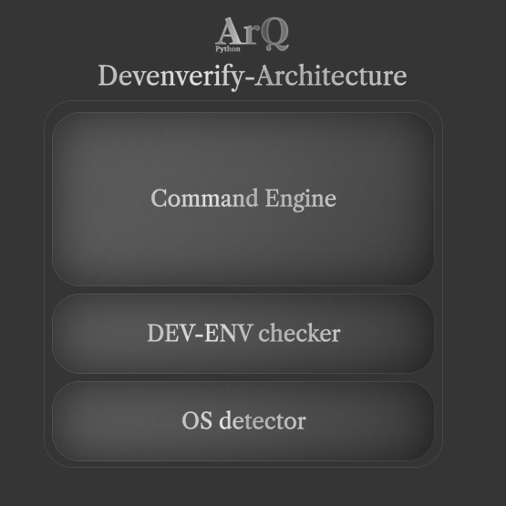

# Devenverify Architecture

---

Since the devenverify is an app to verify the dev env of python just like the doctor thing of flutter than here is the stuff to verify for the sake of python dev env to be to be ready :
- Python is installed and the latest 
- pip is installed 
- essential packages are installed 
- seeing if UV is installed
   
---

The CLI tool will come at layers :
1. the OS detector 
2. the Dev Env checker 
autonomus layers that works when the program is called 
1. the commands engine 
as mentioned in this diagram :



the project structure will be like this :

```text
ArQ.devenverify/
├── docs/
    ├── architecture.md
    ├── developement.md
    ├── usage.md
    └── architecture.png
├── core/
    ├── __init__.py
    ├── os_detector/
        ├── __init__.py
        ├── osdetector.py
        └── readme.md 
    ├── devenv_checker/
        ├── __init__.py
        ├── devenvchecker.py
        └── readme.md
    ├── command_engine/
        ├── __init__.py
        ├── commandengine.py
        └── readme.md
    ├── core.py
    └── Readme.md
├── main.py
├── readme.md
├── requirements.txt
└── LICENSE
```

the project is under MIT license